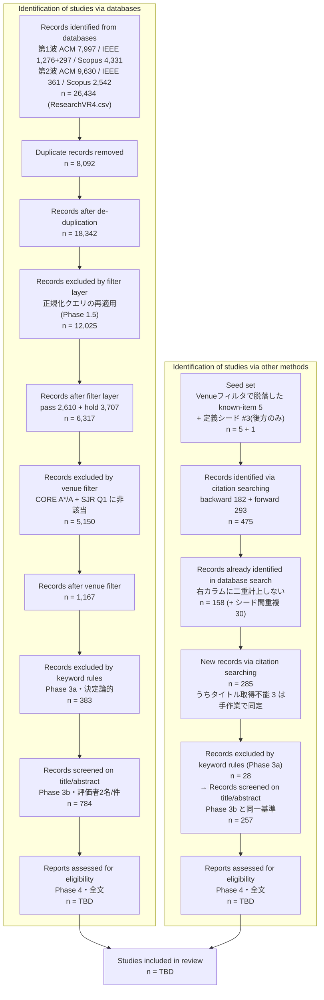

# Snowballing Protocol — 引用探索による補完手続き

> PRISMA 2020「Identification of studies via **other methods**」(フロー図右カラム、
> "Citation searching" の行)に計上する補完検索の手順。
> **なぜ必要か:** `methodology_decision_Rev7.md` の最重要発見 — Known-Item(in-scope)12件中 **5件が
> Venue ホワイトリスト(CORE A\*/A + SJR Q1)で step2 脱落**(`outputs/venue_dropped_known_items.csv`)。
> これは検索式や DB 構成の問題ではなく、厳格な venue 品質フィルタによる学際/ワークショップ会場の
> 取りこぼしである。この構造的な漏れをスノーボーリングで回収し、透明に報告する。
>
> 決定論的・手作業ベースで、LLM は使わない。既存 step ファイルは変更しない。
>
> **【Rev.8 追記】もう一つの役割: PsycINFO 不使用の残余リスク緩和。** DB構成を3DB
> (ACM/IEEE/Scopus)に確定し PsycINFO を不採用としたため(`protocol_changelog.md` Rev.8)、
> Scopus が拾いきれない PsycINFO 固有収録誌の心理系文献は本プロトコルの検索段階では
> 構造的に見落とされ得る。本スノーボーリングは venue フィルタの取りこぼし回収に加えて、
> **この残余リスクを部分的に緩和する役割も兼ねる**(`methodology_decision_Rev7.md` §Rev.8追記の
> PsycINFO 正当化ドラフトの一部)。

---

## 0. 2つの目的を分離する(2026-08-10 改訂)

本手続きは長らく「Venue フィルタで脱落した Known-Item **6件の回収**」と説明してきたが、
実際には性質の違う2つの作業が混ざっており、それが工数の大半を無駄にしていた。以下のとおり分離する。

| | (A) 既知文献の回収 | (B) 未知文献の発見 |
|---|---|---|
| 対象 | step2 で脱落した Known-Item **5件** | まだ誰も気づいていない主題適合文献 |
| 手段 | **DOI による直接回収**(下記 §1.1) | citation searching(前方・後方探索) |
| 探索コスト | **ゼロ**(DOI は既知) | 新規候補の人手判定(Rev.15 実測 257件) |
| 判断 | `drop_category` 別の決定論的ルーティング | PICOS による個別判定 |

**要点: 5件は「既知」なのだから、引用探索で釣り上げる対象ではない。**
DOI が分かっている文献を、多数の候補を読んで回収するのは手段と目的が逆立ちしている。
citation searching が本来担うのは (B) — venue フィルタが落とした**未知の**文献の発見であり、
5件はその探索の**シード**であって回収**対象**ではない。

### 1.1 (A) 既知5件の回収 — 決定論的ルーティング

`outputs/venue_dropped_known_items.csv` の `drop_category` に従い、各件を以下に振り分ける。
citation searching は使わない。判断と理由は PROGRESS_LOG.md に記録する。

| drop_category | 該当 | 処理 |
|---|---|---|
| `unmatched` | #7 Augmented Human / #8 APGV-SAP / #13 MIG | `venue_aliases.csv`・正規化改修(`normalization_design.md`)で救済を試す。A\*/A・Q1 に照合されれば **step2 に復帰**(左カラム。右カラムには計上しない) |
| `below_rank` | #10 ICAT-EGVE(CORE C) | 会場はリストにあるがランク不足。品質基準を貫くなら除外維持。seminal な場合のみ**限定的復帰**を Threats に明記のうえ許容 |
| `criterion` | #14 Cognitive Processing(SJR Q2) | 基準どおりの除外。**復帰させない**。Threats で「Q1限定により失われた主題関連文献」として報告 |

> **左カラム / 右カラムの別に注意:** `unmatched` の救済は「検索では捕捉できていた文献の
> 照合ミスの修正」なので **左カラム(database searching)の話**であり、
> "Identification via other methods" に計上してはならない。

---

## 1. 対象(シード)の選び方

以下は **(B) 未知文献の発見** のためのシード選定である。
スノーボーリングの起点(seed set)は**恣意的に広げない**。以下に限定する:

1. **step2 で脱落した Known-Item 5件**(`outputs/venue_dropped_known_items.csv`)。
   これらは (A) で直接回収する対象そのものではなく、**同種の未知文献を掘り当てるための起点**として使う
   (回収と発見の区別は §0)。
2. **最終候補(step3_kw_included.csv)に生存した高中心性の文献**のうち、著者が
   レビューの柱(Intro/RW/Taxonomy の引用予定)に据えるもの。数を絞る(例: 10〜20件)。
3. Known-Item のうち **background(#19 Botvinick&Cohen 1998, #20 Lenggenhager 2007 等)**は、
   心理接合点の境界を示す文献として**後方探索の到達目標**に使う(これらに辿り着けるかで
   接合点カバレッジを点検)。ただし非VRのため本レビューへの採否は PICOS で個別判断。
   **Rev.8 での位置づけ:** これらは PsycINFO が本来カバーするはずの心理系古典でもあり、
   3DB(ACM/IEEE/Scopus)からの前方探索でどこまで到達できるかは、PsycINFO 不使用の
   残余リスクがどの程度実害を伴うかの簡易的な点検にもなる(`known_items.md` Rev.8追記参照)。

> **区別の明記:** シード自体(step3 生存分)は既にDB検索で捕捉済みなので二重計上しない。
> スノーボーリングで**新たに**発見され、かつDB検索の統合データに不在の文献のみを
> "other methods" に計上する。

### 1.2 シードの性質による扱いの差(2026-08-10 実測にもとづく)

**改修前**の1ホップ実行(2026-08-10、1,854行 / 新規1,433件。旧ログは
`outputs/snowballing_log_pre20260810.csv`)を
シード別に集計すると、**主題シードと定義シードで効率が2桁違う**ことが分かった。
「G3語(size/scale/height/distance)を含む率」は主題適合性の決定論的な代理指標である。

| シード | 性格 | 新規候補 | G3語を含む率 |
|---|---|---|---|
| #10 Dwarf or Giant | 主題(眼高・IPD) | 22 | **59.1%** |
| #8 eye height and avatars | 主題(眼高) | 77 | **42.9%** |
| #13 Scaling Player Size | 主題(スケーリング) | 8 | 37.5% |
| #7 Distortion in Perceived Size | 主題(サイズ知覚) | 34 | 29.4% |
| #14 Gulliver's virtual travels | 主題(極端身体サイズ) | 44 | 18.2% |
| **#3 The Sense of Embodiment in VR** | **用語定義** | **1,248** | **0.9%** |

**#3 だけで新規候補の 87% を占め、しかも主題密度は他シードの 1/30 〜 1/60 である。**
理由は明白で、#3(Kilteni et al. 2012)は身体化研究全体の用語定義の典拠として
被引用1,500件超を持つ論文であり、その前方探索は「自己スケール文献」ではなく
「身体化文献すべて」を引いてくる。

**#3 由来1,188件(前方・新規)を目視した結果:** G3語を含む11件のうち、実際に主題適合なのは
**2件のみ**(`Perception and Embodiment for Motion-Scaled Virtual Hands`、
`Effects of Viewpoint Height & Fluctuation on Walking Perception`)。残る9件は誤爆で、
内訳は `embodiment scale`=**質問紙の尺度**、`Large-scale`/`Scalable`=**システム規模**、
`aesthetic distance`=**比喩的な距離**、`heightism`=身長の社会学(VRですらない)。
**1,188件を読んで2件**という効率である。

### 1.3 決定(2026-08-11 著者確定): #3 は後方探索のみ

**#3 を前方探索のシードから外す。後方探索は残す。**

対して **#3 の後方探索(参考文献65件)は高価値**であることが実測で確認された。
本プロトコルが §1(3) で「後方探索の到達目標」としていた心理接合点の古典に、すべて到達している:

| 到達 | 文献 |
|---|---|
| ✅ | Botvinick & Cohen 1998(ラバーハンド錯覚) |
| ✅ | Lenggenhager et al. 2007(Video ergo sum) |
| ✅ | Slater et al. 2010(body transfer) |
| ✅ | Petkova & Ehrsson 2008(body swap) |

定義論文は「何を土台にしたか」を辿る方向でのみ機能する。前方は身体化研究全体を引いてくるだけである。

**実装:** `snowball_search.py` の `DEFINITIONAL_SEEDS = ("3",)`。
`--no-forward-seeds` で上書き可能(空文字を渡せば従来どおり全シードで前方探索する)。

**方針まとめ:**
- **主題シード5件(#7/#8/#10/#13/#14)は前方・後方とも全件を読む。** 計185件、密度18〜59%。
- **#3 は後方のみ**(65件)。
- 人手判定の対象は **1,433件 → 257件**に圧縮された(Rev.15 実測)。
- **PRISMA-S に逸脱として明記する**: 「シード1件(定義典拠論文)については前方探索を実施していない。
  理由は被引用が主題非依存であり、実測で1,188件中の主題適合が2件であったため」。

### 1.4 後方探索のメタデータ補完(必須)

後方探索は Crossref フォールバック経由だと **DOI しか返らない項目が多い**。実測(2026-08-10)では
後方173件のうち **93件(54%)がタイトル欠落**、要旨は全件欠落だった(前方は S2 由来で欠落0件)。
**この状態では Title/Abstract を読む Phase 3b にかけられない。**

`snowball_search.py` は後方探索の結果に対し、DOI を持つが Title/Abstract を欠くレコードを
S2 の `/paper/DOI:` で解決してから記録する(`resolve_missing_metadata()`)。
**DOI が無いレコードは解決しない**(タイトル照合による同定は誤同定の危険があるため)。
解決できなかった件数は §4.4 の「DOI 欠落は手作業で同定」の対象として残る。

## 2. 手続き

### 2.1 後方探索(backward / 引用文献をたどる)

- 各シードの**参考文献リスト**を精査し、主題(VR × 自己スケール/身体化)に適合する
  候補を抽出する。
- 出典は原著PDFの References。補助的に Crossref / Semantic Scholar の
  "references" を用いてよい(件数確認のみ。採否は本文で判断)。

### 2.2 前方探索(forward / 被引用をたどる)

- 各シードを**引用している**新しい文献を Google Scholar / Semantic Scholar の
  "Cited by" で辿り、主題適合の候補を抽出する。
- step2 脱落の below_rank 会場(Presence, ICAT-EGVE 等)の重要論文は、
  後続の A\*/A・Q1 会場論文から前方探索で回収できることが多い。

### 2.3 反復と停止

- 新たに採用した文献をシードに加えて 1 回だけ反復する(2 ホップまで)。
- 新規採用が実務的にゼロに収束したら停止する。**反復回数と各回の新規件数を記録**する。

## 3. 採否判定(既存基準と同一)

- スノーボーリングで得た候補も、**本編と同じ PICOS / Phase 3b の人手基準**で採否を判定する。
  検索経路が違うだけで、包含基準は緩めない。
- **Venue ランク(CORE/SJR)基準の適用について**は、脱落カテゴリ別に扱う
  (`outputs/venue_dropped_known_items.csv` の `drop_category`)。
  **既知5件そのものの処理は §1.1 に集約した**(以下は同じ規則の詳述):
  - `criterion`(例 #14 Gulliver, SJR Q2): 品質基準どおりの除外。**原則として本編には復帰させず**、
    Threats to Validity で「Q1限定により失われた主題関連文献」として報告する。
  - `unmatched`(例 #7/#8/#13, リスト未照合): まず `venue_aliases.csv`・正規化での救済を試す
    (`normalization_design.md`)。救済で A\*/A・Q1 に照合されれば step2 に復帰。
    真にランキング未収載(ワークショップ等)なら、スノーボーリングでの回収+個別判断。
  - `below_rank`(例 #10 ICAT-EGVE=CORE C): 会場はリストにあるがランク不足。
    品質基準を貫くなら除外維持。ただし当該文献が seminal な場合は、
    **「Known-Item として著者が必須と判断した文献の限定的復帰」**を Threats に明記のうえ許容してよい。
    判断と理由を PROGRESS_LOG.md に必ず記録する。

## 4. 記録と PRISMA 報告

### 4.1 PRISMA 2020 フロー図における位置づけ

PRISMA 2020 の「データベース検索 + その他の情報源」版フロー図を用いる。
スノーボーリングで得た文献は**右カラム(Identification of studies via other methods)**を通り、
Phase 4 の適格性評価で左カラムと合流する。

### 4.2 各ステップの定義(右カラム)

| 段階 | 定義 | 現在値 |
|---|---|---|
| Seed set | Known-Item Test で **Phase 2 の Venue フィルタにより脱落**した in-scope 文献(5)+ 定義シード #3(後方専用、§1.3) | 5 + 1 |
| Records identified | シードの前方(被引用)・後方(参考文献)を1ホップ探索して得た文献。DOI優先・正規化タイトル代替で一意化 | 475 |
| うち重複 | 既存コーパスに既出 158 + シード間の重複 30 | 188 |
| New records | 右カラムの "Records identified via citation searching" として報告する数 | **285** |
| Screened | Phase 3a 除外 28 を引いて Phase 3b と**同一の**基準で Title/Abstract 判定 | **257** |
| Assessed | 全文評価(Phase 4)。左カラムと同じ体制・同じ PICOS | TBD |

### 4.3 ★重要な設計判断: 右カラムに Venue フィルタを適用しない

**右カラムには Phase 2(CORE A*/A + SJR Q1)を適用しない。**

理由: スノーボーリングの目的が「**Venue フィルタが落とした主題関連文献の回収**」である以上、
回収したものに同じフィルタを掛け直せば同じ理由で再び落ちる。目的と手段が矛盾する。
実際、シード #10(ICAT-EGVE)・#13(MIG)はいずれも低ランク会場で脱落した文献であり、
Venue フィルタを適用すると自分自身すら通らない。

参考値(Rev.15 実測)として、判定対象257件のうち Phase 2 基準を満たすのは **92件**、満たさないのが **165件**。
**この824件こそが本来の回収対象**であり、ここを切ると右カラムを設ける意味が無くなる。

`snowball_search.py` が付与する `venue_rank_note` は**参考情報であり採否には使わない**
(スクリプト側でもフィルタしていない)。読む順序のトリアージにのみ用いてよい。

> **本文への記載(必須)**: 「厳格な venue 品質フィルタ(CORE A*/A + SJR Q1)により
> 学際・ワークショップ会場の主題関連文献が系統的に脱落することが Known-Item Test で判明したため
> (in-scope 12件中5件)、脱落文献を起点とする citation searching を補完的に実施した。
> **citation searching で同定した文献には venue フィルタを適用していない**」ことを明記する。

### 4.3b 右カラムに適用する段・しない段(2026-08-16 実行後に確定)

Phase 1.5(フィルタ層)は Rev.13 で新設されたため §4.3 執筆時には存在しなかった。
実行後の実測をふまえ、右カラムに何を適用するかを次のとおり確定する。

| 段 | 右カラムへの適用 | 理由 |
|---|---|---|
| Phase 1.5 フィルタ層 | **適用しない** | 目的が「DB間の検索scope差の吸収」であり、DB検索で取得していない文献には吸収すべき差が存在しない。かつ「クエリが取りこぼしたものを拾う」目的に対しクエリを再適用するのは §4.3 と同じ自己矛盾 |
| Phase 2 Venueランク | **適用しない**(§4.3) | 下記の実測を根拠として確定 |
| Phase 3a キーワード除外 | **適用する** | PICOS 由来の適格性基準。「検索経路が違うだけで包含基準は緩めない」(§3) |
| Phase 3b 人手判定 | **適用する** | 下記の注参照 |

**Venue フィルタを適用しないことの実測根拠(2026-08-16):**
判定対象257件に Phase 2 を適用すると **165件(64%)が消える**が、その内訳は

| 判定 | 件数 |
|---|---|
| 通過 | 92 |
| **未照合** | **88** |
| **venue名なし** | **49** |
| ランク不足 | 28 |

であり、**除外の83%(137/165)は品質判断ではなく照合失敗**である。右カラムの venue 文字列は
Crossref/S2 由来で非正規(`Conscious Cogn` / `J Exp Psychol Hum Percept Perform` のような
短縮形)であり、Zotero で正規化された左カラムとは**照合の前提が違う**。実際に
`Science`・`Cognition`・`Experimental Brain Research` といった主要誌が未照合で落ちる。
さらに落ちる会場には **`Presence` と `ICAT-EGVE`** が含まれるが、これは gold set #3・#10 が
step2 で脱落した当の会場であり、回収目的を自ら打ち消すことになる。

> **【前例についての正直な注記】** この非対称な運用(DB検索には venue フィルタを適用し、
> 引用探索には適用しない)について、**明確な前例は文献調査では確認できなかった**。
> したがってこれは「標準手法だから」ではなく、**上記の実測を根拠に本レビューが立てた判断**である。
> 成立の前提は「**venue 制限は検索スコープの定義であって適格性基準ではない**」という位置づけであり、
> これを `rule.md` に明記し、PRISMA-S に逸脱として記載し、本文では
> **最終的に採択された文献が2つの異なる品質レジームから来ること**を明示する(§4.6)。

> **【Phase 3b を設ける理由】** PRISMA 2020 の公式フロー図では、右カラムに
> Title/Abstract スクリーニングの箱が無く、**identification から全文評価へ直行する**想定である
> (引用探索は通常「参考文献リストを人が読んで拾う」作業で、その時点で人手フィルタが効いているため)。
> 本レビューの右カラムは `snowball_search.py` による機械生成で人手フィルタを経ていないため、
> この想定が当てはまらない。**規定より慎重に** Title/Abstract 段を設ける
> (257件をいきなり全文評価するより工数も少ない)。

### 4.4 計上ルール

- `in_db_already=Y` の398件は**右カラムに計上しない**(左カラムで既に同定済み)。
- **DOI 欠落139件**は自動照合では既出判定ができない。手作業でタイトル照合し、
  既出なら `in_db_already` を Y に修正してから計上する(**未実施**)。
- 探索は **1ホップのみ実施済み**。2ホップ目を行う場合は
  `--seeds-csv` で採用文献を再投入し、**ホップごとに件数を分けて記録**する。
- Frontiers in VR の journal hand-search(`search_replication.md`)は同じ右カラムだが、
  "Websites/Organisations" 行として **citation searching とは別行**に計上する。
- **後方探索が取得できなかったシード #10**(S2 非開示・Crossref 未登録)は、
  取得不能である旨を Limitations に記載する。手作業補完を行った場合はその旨も記録する。

### 4.5 出力ファイルの列

`outputs/snowballing_log.csv`

| 列 | 内容 |
|---|---|
| `seed_id` / `seed_title` | シード文献 |
| `direction` | `backward`(参考文献) / `forward`(被引用) |
| `found_title` / `found_doi` / `found_year` / `found_venue` | 発見された文献 |
| `found_abstract` | 要旨(**2026-08-10 追加**)。Phase 3b は Title/Abstract を読む手続きなので、これが無いとログ単体でスクリーニングできない |
| `in_db_already` | `Y`=既存コーパスに既出(右カラムに計上しない) / `N`=新規 |
| `venue_rank_note` | CORE/SJR 照合結果。**参考情報。採否には使わない** |
| `ref_source` | `S2` / `Crossref` / `取得不可`。後方探索の取得経路(PRISMA-S 用) |
| `kw_g1` / `kw_g2` / `kw_g3` / `kw_groups` | Title+Abstract に対する概念群の命中(**2026-08-10 追加**)。§4.6 の**読む順序専用** |
| `picos_decision` | **空欄** ← 著者が include/exclude を記入 |
| `reason` | **空欄** ← 著者が理由を記入 |

> **旧ログとの非互換:** 2026-08-10 に5列を追加したため、旧12列の
> `outputs/snowballing_log.csv` には追記できない(スクリプトが列構成を照合して中断する)。
> 再実行前に旧ログを `outputs/snowballing_log_pre20260810.csv` に退避すること。

### 4.6 読む順序のトリアージ(概念群スコア)

`kw_groups` は Title+Abstract に Rev.6 統合クエリの3概念群がいくつ成立したかを表す
(決定論的・LLM 不使用)。**降順に読む**ことで、少ない読解量で主題適合文献に到達できる。

**これは順序付けであって除外ではない。** citation searching の存在意義は
「検索式が取りこぼした文献の回収」なので、同じ検索式で機械的に切れば目的と矛盾する
(§4.3 で venue フィルタを右カラムに適用しないのと同じ理屈)。
`kw_groups` による足切りを行う場合は、**適用範囲・閾値・除外件数を PRISMA-S に
逸脱として明記する**こと(§1.2 の #3 対応がこれに該当する)。

> **タイトルだけでは判定できない(実測):** 新規1,433件のうち、**タイトルのみで3群が
> 揃うのは 0件**であった。IEEE 第2波で実際に検索がヒットした文献でも、タイトルのみ成立は
> 5%、Title+Abstract で 91% が成立する。`found_abstract` の取得が
> トリアージ成立の前提条件である。

## 5. 完了チェックリスト

- [ ] step2 脱落 Known-Item 6件すべてについて回収可否と最終判断を記録した
- [ ] `outputs/snowballing_log.csv` に全候補の採否・理由・DB既出フラグがある
- [ ] `in_db_already = Y` の文献を "other methods" に二重計上していない
- [ ] PRISMA 右カラム(citation searching / hand-search)の n を確定した
- [ ] below_rank/criterion の限定復帰があれば Threats to Validity と PROGRESS_LOG.md に記録した
