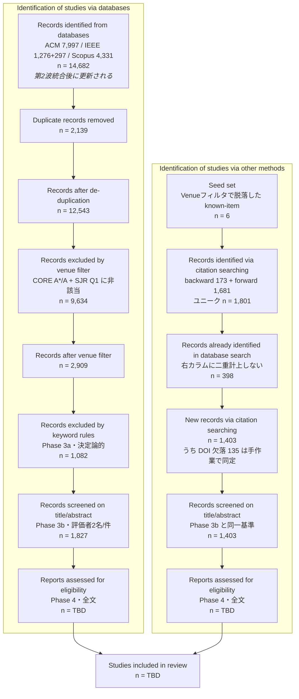

# Snowballing Protocol — 引用探索による補完手続き

> PRISMA 2020「Identification of studies via **other methods**」(フロー図右カラム、
> "Citation searching" の行)に計上する補完検索の手順。
> **なぜ必要か:** `methodology_decision_Rev7.md` の最重要発見 — Known-Item 13件中 **6件が
> Venue ホワイトリスト(CORE A\*/A + SJR Q1)で step2 脱落**(`outputs/venue_dropped_known_items.csv`)。
> これは検索式や DB 構成の問題ではなく、厳格な venue 品質フィルタによる学際/ワークショップ会場の
> 取りこぼしである。この構造的な漏れをスノーボーリングで回収し、透明に報告する。
>
> 決定論的・手作業ベースで、LLM は使わない。既存 step ファイルは変更しない。
>
> **【Rev.8 追記】もう一つの役割: PsycINFO 不使用の残余リスク緩和。** DB構成を3DB
> (ACM/IEEE/Scopus)に確定し PsycINFO を不採用としたため(`protocol_changelog.md` Rev.8)、
> Scopus が拾いきれない PsycINFO 固有収録誌の心理系文献は本プロトコルの検索段階では
> 構造的に見落とされ得る。本スノーボーリングは venue フィルタの取りこぼし回収に加えて、
> **この残余リスクを部分的に緩和する役割も兼ねる**(`methodology_decision_Rev7.md` §Rev.8追記の
> PsycINFO 正当化ドラフトの一部)。

---

## 1. 対象(シード)の選び方

スノーボーリングの起点(seed set)は**恣意的に広げない**。以下に限定する:

1. **step2 で脱落した Known-Item 6件**(`outputs/venue_dropped_known_items.csv`)。
   これらは著者が「必ず含まれるべき」と事前判断した文献であり、回収の第一優先。
2. **最終候補(step3_kw_included.csv)に生存した高中心性の文献**のうち、著者が
   レビューの柱(Intro/RW/Taxonomy の引用予定)に据えるもの。数を絞る(例: 10〜20件)。
3. Known-Item のうち **background(#19 Botvinick&Cohen 1998, #20 Lenggenhager 2007 等)**は、
   心理接合点の境界を示す文献として**後方探索の到達目標**に使う(これらに辿り着けるかで
   接合点カバレッジを点検)。ただし非VRのため本レビューへの採否は PICOS で個別判断。
   **Rev.8 での位置づけ:** これらは PsycINFO が本来カバーするはずの心理系古典でもあり、
   3DB(ACM/IEEE/Scopus)からの前方探索でどこまで到達できるかは、PsycINFO 不使用の
   残余リスクがどの程度実害を伴うかの簡易的な点検にもなる(`known_items.md` Rev.8追記参照)。

> **区別の明記:** シード自体(step3 生存分)は既にDB検索で捕捉済みなので二重計上しない。
> スノーボーリングで**新たに**発見され、かつDB検索の統合データに不在の文献のみを
> "other methods" に計上する。

## 2. 手続き

### 2.1 後方探索(backward / 引用文献をたどる)

- 各シードの**参考文献リスト**を精査し、主題(VR × 自己スケール/身体化)に適合する
  候補を抽出する。
- 出典は原著PDFの References。補助的に Crossref / Semantic Scholar の
  "references" を用いてよい(件数確認のみ。採否は本文で判断)。

### 2.2 前方探索(forward / 被引用をたどる)

- 各シードを**引用している**新しい文献を Google Scholar / Semantic Scholar の
  "Cited by" で辿り、主題適合の候補を抽出する。
- step2 脱落の below_rank 会場(Presence, ICAT-EGVE 等)の重要論文は、
  後続の A\*/A・Q1 会場論文から前方探索で回収できることが多い。

### 2.3 反復と停止

- 新たに採用した文献をシードに加えて 1 回だけ反復する(2 ホップまで)。
- 新規採用が実務的にゼロに収束したら停止する。**反復回数と各回の新規件数を記録**する。

## 3. 採否判定(既存基準と同一)

- スノーボーリングで得た候補も、**本編と同じ PICOS / Phase 3b の人手基準**で採否を判定する。
  検索経路が違うだけで、包含基準は緩めない。
- **Venue ランク(CORE/SJR)基準の適用について**は、脱落カテゴリ別に扱う
  (`outputs/venue_dropped_known_items.csv` の `drop_category`):
  - `criterion`(例 #14 Gulliver, SJR Q2): 品質基準どおりの除外。**原則として本編には復帰させず**、
    Threats to Validity で「Q1限定により失われた主題関連文献」として報告する。
  - `unmatched`(例 #7/#8/#13, リスト未照合): まず `venue_aliases.csv`・正規化での救済を試す
    (`normalization_design.md`)。救済で A\*/A・Q1 に照合されれば step2 に復帰。
    真にランキング未収載(ワークショップ等)なら、スノーボーリングでの回収+個別判断。
  - `below_rank`(例 #3 Presence=CORE C, #10 ICAT-EGVE=CORE C): 会場はリストにあるがランク不足。
    品質基準を貫くなら除外維持。ただし当該文献が seminal(#3 Kilteni 2012 は用語定義の典拠)な場合は、
    **「Known-Item として著者が必須と判断した文献の限定的復帰」**を Threats に明記のうえ許容してよい。
    判断と理由を PROGRESS_LOG.md に必ず記録する。

## 4. 記録と PRISMA 報告

### 4.1 PRISMA 2020 フロー図における位置づけ

PRISMA 2020 の「データベース検索 + その他の情報源」版フロー図を用いる。
スノーボーリングで得た文献は**右カラム(Identification of studies via other methods)**を通り、
Phase 4 の適格性評価で左カラムと合流する。

### 4.2 各ステップの定義(右カラム)

| 段階 | 定義 | 現在値 |
|---|---|---|
| Seed set | Known-Item Test で **Phase 2 の Venue フィルタにより脱落**した in-scope 文献 | 6 |
| Records identified | シードの前方(被引用)・後方(参考文献)を1ホップ探索して得た文献。DOI優先・正規化タイトル代替で一意化 | 1,801 |
| うち重複 | 既存コーパス(`raw/*.csv` + `step3_kw_included.csv`)に既出。**左カラムで同定済みなので右では数えない** | 398 |
| New records | 右カラムの "Records identified via citation searching" として報告する数 | **1,403** |
| Screened | Phase 3b と**同一の**適格性基準で Title/Abstract 判定 | 1,403 |
| Assessed | 全文評価(Phase 4)。左カラムと同じ体制・同じ PICOS | TBD |

### 4.3 ★重要な設計判断: 右カラムに Venue フィルタを適用しない

**右カラムには Phase 2(CORE A*/A + SJR Q1)を適用しない。**

理由: スノーボーリングの目的が「**Venue フィルタが落とした主題関連文献の回収**」である以上、
回収したものに同じフィルタを掛け直せば同じ理由で再び落ちる。目的と手段が矛盾する。
実際、シード #10(ICAT-EGVE)・#13(MIG)はいずれも低ランク会場で脱落した文献であり、
Venue フィルタを適用すると自分自身すら通らない。

参考値として、新規1,403件のうち Phase 2 基準を満たすのは **579件**、満たさないのが **824件**。
**この824件こそが本来の回収対象**であり、ここを切ると右カラムを設ける意味が無くなる。

`snowball_search.py` が付与する `venue_rank_note` は**参考情報であり採否には使わない**
(スクリプト側でもフィルタしていない)。読む順序のトリアージにのみ用いてよい。

> **本文への記載(必須)**: 「厳格な venue 品質フィルタ(CORE A*/A + SJR Q1)により
> 学際・ワークショップ会場の主題関連文献が系統的に脱落することが Known-Item Test で判明したため
> (13件中6件)、脱落文献を起点とする citation searching を補完的に実施した。
> **citation searching で同定した文献には venue フィルタを適用していない**」ことを明記する。

### 4.4 計上ルール

- `in_db_already=Y` の398件は**右カラムに計上しない**(左カラムで既に同定済み)。
- **DOI 欠落135件**は自動照合では既出判定ができない。手作業でタイトル照合し、
  既出なら `in_db_already` を Y に修正してから計上する(**未実施**)。
- 探索は **1ホップのみ実施済み**。2ホップ目を行う場合は
  `--seeds-csv` で採用文献を再投入し、**ホップごとに件数を分けて記録**する。
- Frontiers in VR の journal hand-search(`search_replication.md`)は同じ右カラムだが、
  "Websites/Organisations" 行として **citation searching とは別行**に計上する。
- **後方探索が取得できなかったシード #10**(S2 非開示・Crossref 未登録)は、
  取得不能である旨を Limitations に記載する。手作業補完を行った場合はその旨も記録する。

### 4.5 出力ファイルの列

`outputs/snowballing_log.csv`

| 列 | 内容 |
|---|---|
| `seed_id` / `seed_title` | シード文献 |
| `direction` | `backward`(参考文献) / `forward`(被引用) |
| `found_title` / `found_doi` / `found_year` / `found_venue` | 発見された文献 |
| `in_db_already` | `Y`=既存コーパスに既出(右カラムに計上しない) / `N`=新規 |
| `venue_rank_note` | CORE/SJR 照合結果。**参考情報。採否には使わない** |
| `ref_source` | `S2` / `Crossref` / `取得不可`。後方探索の取得経路(PRISMA-S 用) |
| `picos_decision` | **空欄** ← 著者が include/exclude を記入 |
| `reason` | **空欄** ← 著者が理由を記入 |

## 5. 完了チェックリスト

- [ ] step2 脱落 Known-Item 6件すべてについて回収可否と最終判断を記録した
- [ ] `outputs/snowballing_log.csv` に全候補の採否・理由・DB既出フラグがある
- [ ] `in_db_already = Y` の文献を "other methods" に二重計上していない
- [ ] PRISMA 右カラム(citation searching / hand-search)の n を確定した
- [ ] below_rank/criterion の限定復帰があれば Threats to Validity と PROGRESS_LOG.md に記録した
